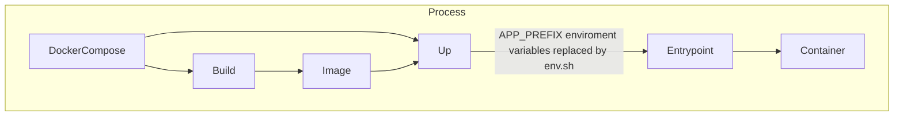

In this tutorial, we'll walk through the process of setting up dynamic environment variables in a Vite project, ensuring that these variables can be replaced dynamically within a Docker container. This setup allows for flexibility and ease of deployment across different environments.

## Setting Up the Environment Variables

First, ensure that your environment variables for Vite start with the `VITE_` prefix. This is because vite itself uses the `VITE_` prefix in the `.env` file to load the right enviroment value.

### Step 1: Define Environment Variables

Create environment variable files for different environments at the root of your project. Vite uses different `.env` files for different environments:

- **Production:** Create a `.env.production` file.
- **Local Development:** Optionally, create a `.env.local` file for local development.


In this `.env.production` you want to write the name of the environment variable that has to be replace with the value. The reason is that this value will be placed in your code during build time. When we are running the docker container we are going to run a script that will replace the value in the source with the value that is passed in the environment by docker compose.

#### Example: `.env.production`

```properties
VITE_VALUE=PREFIX_VALUE
```

```typescript
class Environment {
    VALUE: string;
    constructor() {
        this.VALUE = import.meta.env.VITE_VALUE;
    }
}

const environment = new Environment();

export default environment;
```

This will be replaced in build time by this.

```typescript
class Environment {
    VALUE: string;
    constructor() {
        this.VALUE = "PREFIX_VALUE";
    }
}

const environment = new Environment();

export default environment;
```

And when we run the env.sh script it will replace this marker with the value in the environment like this.

```typescript
class Environment {
    VALUE: string;
    constructor() {
        this.VALUE = "This is the value you want to dynamically use in your container.";
    }
}

const environment = new Environment();

export default environment;
```

So everytime you start your docker container it will replace the value in the source with the value in the environment.


### Step 2: Create an Environment Class

In your project, create a class to map these Vite environment variables to constants that you can use throughout your project.

```typescript
class Environment {
    VALUE: string;
    constructor() {
        this.VALUE = import.meta.env.VITE_VALUE;
    }
}

const environment = new Environment();

export default environment;
```

## Setting Up the Tooling

We'll use a shell script to dynamically replace the baked-in environment variables within the Docker container.

### Step 3: Create a Shell Script

Create a file named `env.sh` with the following content. 

 > **Important**: Ensure the file has `LF` line endings, not `CRLF`.

```shell
#! /bin/sh

if [ -z "$APP_ENV_PREFIX" ]; then
    echo "APP_ENV_PREFIX is not set. Exiting."
    exit 1
fi

for i in $(env | grep "^$APP_ENV_PREFIX"); do
    key=$(echo "$i" | cut -d '=' -f 1)
    value=$(echo "$i" | cut -d '=' -f 2-)
    
    echo "$key=$value"
    
    find "/usr/share/nginx/html/web-app" -type f -exec sed -i 's|'"${key}"'|'"${value}"'|g' {} \;
    find "/tmpl/dist/web-app/" -type f -exec sed -i 's|'"${key}"'|'"${value}"'|g' {} \;  
done
```

Ensure that the `$APP_ENV_PREFIX` matches your chosen prefix (`PREFIX_` in this example). The path `/tmpl/dist/web-app/` should match the location of your built project within the Docker container.

## Setting Up the Docker Container

### Step 4: Create a Dockerfile

Create a `Dockerfile` with the following content:

```dockerfile
FROM node:23-alpine AS builder

WORKDIR /app
COPY package*.json ./
RUN npm ci
COPY . .
RUN npm run build

FROM nginx:alpine

COPY ./nginx.conf /etc/nginx/nginx.conf
COPY --from=builder /app/dist /var/www/html/

# This is the important part
# Copy the script to the entrypoint
COPY env.sh /docker-entrypoint.d/env.sh
# Make sure it has the right line endings using dos2unix
RUN dos2unix /docker-entrypoint.d/env.sh
# Make sure that the script is executable
RUN chmod +x /docker-entrypoint.d/env.sh
# Call entrypoint before you run your main process
ENTRYPOINT ["/docker-entrypoint.sh"]

CMD ["nginx","-g","daemon off;"]
```

### Key Points:

- **File Paths:** Ensure the path `/tmpl/dist/web-app/` matches the location specified in the shell script.
- **Shell Script:** Place the `env.sh` file in `/docker-entrypoint.d/` to ensure it runs on container startup.

## Setting Up Docker Compose

### Step 5: Create a Docker Compose File

Create a `docker-compose.yml` file to define and run your container.

```yaml
services:
    app:
        image: webapp:latest
        environment:
            APP_ENV_PREFIX: PREFIX_
            PREFIX_VALUE: "This is the value you want to dynamically use in your container."
```

### Key Points:

- **Environment Variable Prefix:** Set the `APP_ENV_PREFIX` to match your prefix (`PREFIX_`).
- **Dynamic Values:** Define your environment variables with the specified prefix.



## Conclusion

By following this tutorial, you've set up a Vite project within a Docker container, enabling dynamic environment variables. This approach ensures that your application can adapt to different environments seamlessly, making deployments more flexible and efficient.

Feel free to adjust the paths and prefixes to fit your specific project requirements. Happy coding!