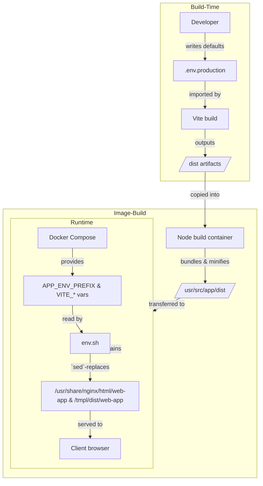

Deploying modern web apps often means juggling configuration for multiple environments—development, staging, production—while keeping your build artifacts immutable. In this post, I’ll walk through how to set up dynamic environment variables in a Vite-based front end so that you can bake sensible defaults at build time, yet override them at container startup without rebuilding. The complete example is available on GitHub:

👉 [github.com/Dutchskull/Vite-Dynamic-Environment-Variables](https://github.com/Dutchskull/Vite-Dynamic-Environment-Variables)

---

## Why dynamic env vars?

Out of the box, Vite injects any variable prefixed with `VITE_` into your client code at build time. That’s great for local development:

```properties
# app/.env.production
VITE_API_URL=https://api.example.com
VITE_FEATURE_FLAG=true
```

But what if you want to deploy the **same** container image to staging or production and tweak these values on the fly? Traditionally you’d need to rebuild for each environment or write extra server-side logic. Instead, we can:

1. **Build once** with sensible defaults (in `app/.env.production`),
2. **Ship** the static files into an NGINX container,
3. **Run** a tiny shell script on startup (`app/env.sh`) that walks through any prefixed vars and `sed`-replaces placeholders in the built files, and
4. **Override** defaults simply by passing new values via Docker Compose or `docker run`.

---

## High-level flow

Below is a Mermaid diagram that visualizes the entire process, from writing your `.env` to serving the final HTML/JS to the client:



---

## 1. Build-time defaults: `app/.env.production`

Keep all your default values here. Any variable prefixed with `VITE_` will be statically inlined by Vite:

```properties
# app/.env.production
VITE_API_URL=https://api.example.com
VITE_FEATURE_FLAG=true
VITE_VALUE=PREFIX_VALUE
```

These values live in your Git history and ensure that anyone cloning the repo can immediately build and run a working app.

---

## 2. Runtime replacement: `app/env.sh`

At container startup, we need to replace every placeholder (e.g. `VITE_API_URL`) in the built files with actual environment variables. Here’s a minimal shell script that:

* Requires an `APP_ENV_PREFIX` (e.g. `VITE_`)
* Iterates over all matching env vars
* Uses `sed` to swap each key for its value

```bash
#!/bin/sh
# app/env.sh

if [ -z "$APP_ENV_PREFIX" ]; then
  echo "ERROR: APP_ENV_PREFIX is not set."
  exit 1
fi

env | grep "^${APP_ENV_PREFIX}" | while IFS='=' read -r key value; do
  echo "Replacing $key → $value"
  find "/usr/share/nginx/html/web-app" -type f -exec sed -i "s|${key}|${value}|g" {} +
  find "/tmpl/dist/web-app"  -type f -exec sed -i "s|${key}|${value}|g" {} +
done
```

By placing this script under `/docker-entrypoint.d/`, NGINX (via the official Alpine image) will execute it automatically before launching.

---

## 3. Multi-stage Dockerfile: `app/Dockerfile`

A lean multi-stage build that produces a static bundle and then a tiny runtime image:

```dockerfile
# app/Dockerfile

# — Build stage —
FROM node:hydrogen-alpine AS build
WORKDIR /usr/src/app
COPY package.json package-lock.json ./
RUN npm ci
COPY . .
RUN npm run build --mode=production

# — Runtime stage —
FROM nginx:mainline-alpine3.18-perl
# (Optional) Custom nginx config
COPY .nginx/${NGINX_CONFIG_FILE:-nginx.conf} /etc/nginx/nginx.conf
RUN rm -rf /usr/share/nginx/html/*

COPY --from=build /usr/src/app/dist /usr/share/nginx/html/web-app
COPY --from=build /usr/src/app/dist /tmpl/dist/web-app

# Add env replacement script
COPY app/env.sh /docker-entrypoint.d/env.sh
RUN dos2unix /docker-entrypoint.d/env.sh \
 && chmod +x /docker-entrypoint.d/env.sh

CMD ["nginx", "-g", "daemon off;"]
```

**Key points:**

* We copy `dist` twice: once to serve directly, and once to a secondary path for any other templating needs.
* The entrypoint directory is baked into the Alpine NGINX image, so our script auto-runs.

---

## 4. Configuration & overrides: `docker-compose.yml`

Instead of rebuilding for each environment, supply overrides at runtime:

```yaml
version: "3.8"
services:
  app:
    build:
      context: ./app
      dockerfile: Dockerfile
    image: webapp:latest
    environment:
      APP_ENV_PREFIX: VITE_
      # Override any VITE_ var here—no rebuild needed
      VITE_API_URL: "https://staging-api.example.com"
      VITE_FEATURE_FLAG: "false"
      VITE_VALUE: "Injected at runtime"
```

With this in place, you can:

* **Build once**: `docker-compose up --build`
* **Override later**:

  ```bash
  VITE_VALUE="Hello from Host!" docker-compose up --no-build
  ```

---

## Conclusion

By combining Vite’s `VITE_`-prefix convention, a tiny startup script, and Docker Compose overrides, you achieve:

* **Immutable builds**—same image across environments
* **Runtime flexibility**—switch APIs, feature flags, or any other setting without rebuilding
* **Clear defaults**—stored in version control for reproducibility

Fork and explore the full source on GitHub:

👉 [github.com/Dutchskull/Vite-Dynamic-Environment-Variables](https://github.com/Dutchskull/Vite-Dynamic-Environment-Variables)

Happy coding and seamless deployments!
